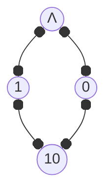
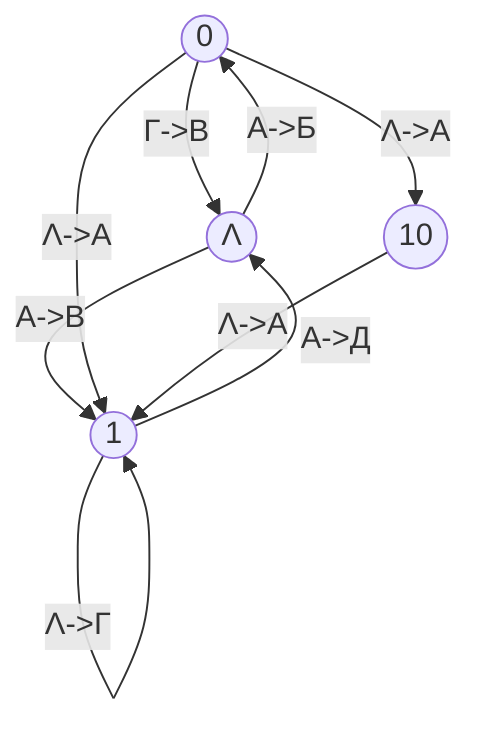

А что делать если при кодировании не соблюдалось прямое и обратное условие Фано? Можно ли однозначно декодировать такое сообщение?

Например, рассмотрим код:
| А | Б | В | Г | Д |
|---|---|---|---|---|
| 01 | 010 | 011 | 11 | 101 |  

Здесь не выполняется ни «прямое», ни «обратное» условие Фано, поэтому декодировать сообщение однозначно, возможно, не удастся.

Ответ можно дать с помощью графа предложенного Александром Александровичем Марковым, построенным следующим образом:

1.  Определим все последовательности, которые совпадают с началом какого-то кодового слова и одновременно с концом какого-то кодового слова; в данном случае это две последовательности:  
0 (начало кода буквы А и конец кода буквы Б)  
1 (начало кода буквы Г и конец кода буквы Д)  
10 (начало кода буквы Д и конец кода буквы Б).  
Цепочки 01 и11 не учитываем, потому что они совпадают с кодами букв «А» и «Г»

2.  Добавим к этому множеству {0, 1, 10} пустую строку, которую обычно обозначают буквой Λ (прописная греческая буква «лямбда»); элементы полученного множества {Λ, 0, 1} становятся узлами графа.

Соединим узлы дугами (направленными рёбрами) по такому правилу: два узла X и Y соединяются дугой, если последовательная запись кода узла X, кода некоторой буквы (или нескольких букв) и кода узла Y даёт код ещё одной буквы

Например, последовательная запись пустой строки (Λ), кода буквы А (01) и цепочки 0 даёт цепочку 010, которая совпадает с кодом буквы Б; поэтому рисуем дугу из вершины Λ в вершину 0; у этой дуги пишем А → Б, и т. д. Поскольку код буквы Г можно записать как 11 = 1Λ1, у вершины 1 появляется петля Λ → Г.

**Любое сообщение декодируется однозначно тогда и только тогда, когда в полученном таким образом графе нет циклов, включающих вершину «Λ».**

В нашем графе есть несколько таких циклов, например:
- цикл «Λ0Λ», соответствующий сообщению ΛА0ГΛ = 01011; это сообщение может быть расшифровано как АВ и как БГ;  
- цикл «Λ1Λ», соответствующий сообщению ΛА1АΛ = 01101; это сообщение может быть расшифровано как АД и как ВА;  
- цикл «Λ01Λ», соответствующий сообщению ΛА01АΛ = 01010Lj это сообщение может быть расшифровано как АДА и как БД;  
- цикл «Λ0101Λ», соответствующий сообщению ΛА0101АΛ = 01010101; это сообщение может быть расшифровано как АБД и как БДА.  

Кроме того, из-за петли у вершины 1 неоднозначно декодируется любая последовательность вида 01... 101, где многоточие обозначает любое количество единиц. Например, сообщение 0111101 может быть декодировано как АГД или ВГА
